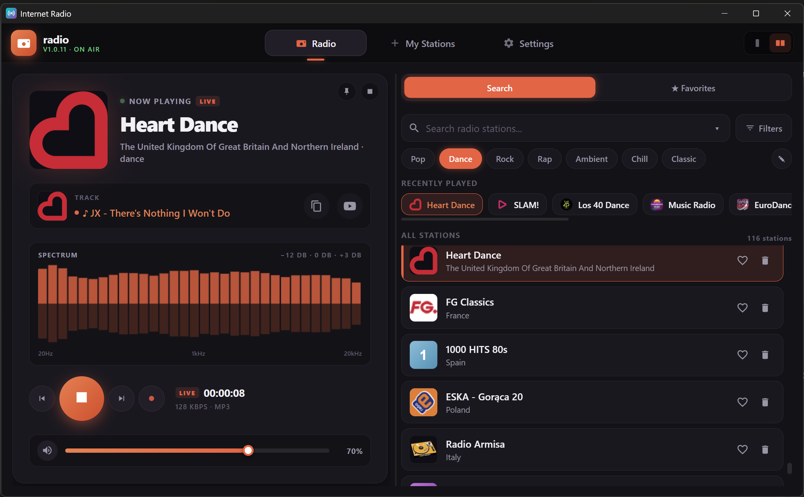
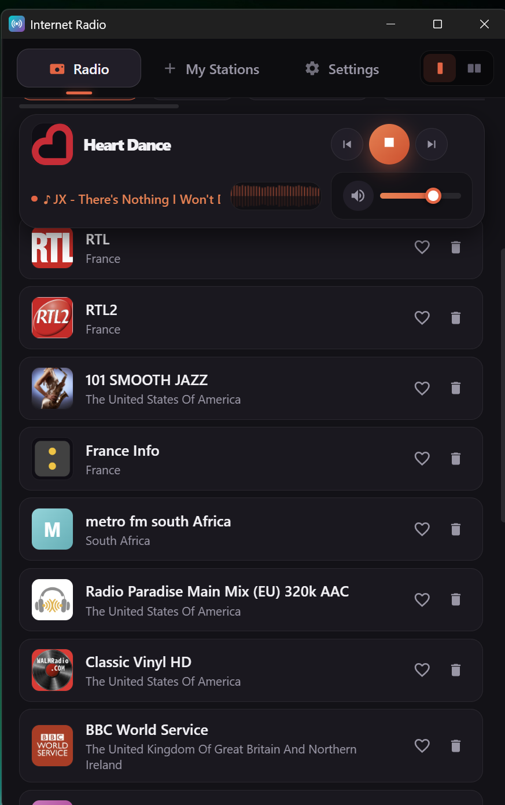
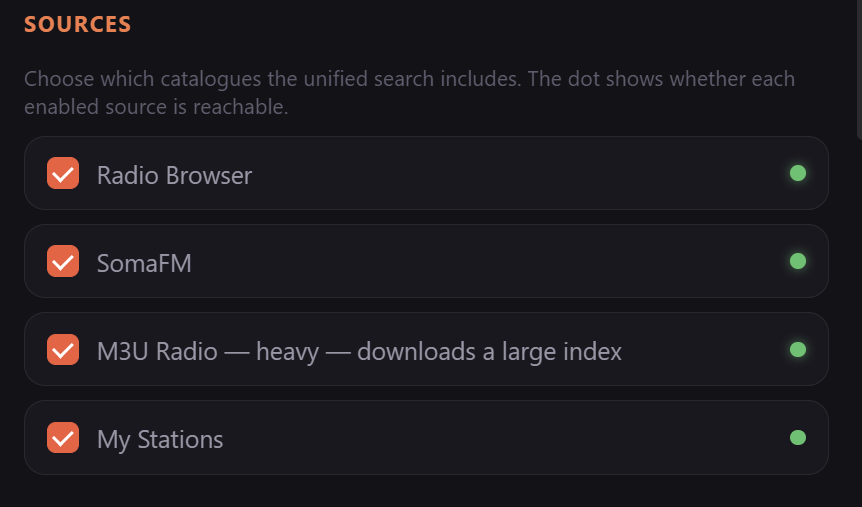
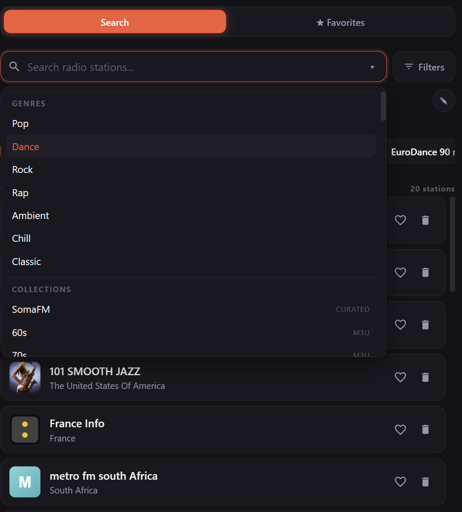

# Internet Radio

A desktop internet‑radio player built with **Tauri 2** (Rust backend) and a
dependency‑free **vanilla‑JS** frontend. Search tens of thousands of stations,
record streams, see live track titles, and tune the sound with a built‑in
equalizer — in a dark “studio” interface.

## Screenshots

| Wide view | Narrow view |
|-----------|-------------|
|  |  |

| Sources (Settings) | Search |
|--------------------|--------|
|  |  |

> Drop the images into an `assets/` folder with the names above.

## Features

### Stations & search
- **Unified search** across all enabled sources at once — Radio Browser,
  SomaFM, M3U Radio, and your own custom stations — with de‑duplicated results.
- **Source management** in Settings: enable/disable each source with a live
  connectivity indicator (M3U Radio is off by default — it builds a large index).
- **Combined search dropdown**: live suggestions, your genre presets, and
  curated collections (SomaFM channels, M3U genres).
- **Filters**: country, tag/genre, minimum bitrate, codec, language, sort order.
- **Editable genre presets** — add, remove and drag‑reorder chips, or add the
  current query straight from the search box with “+”.

### Library
- **Favorites** with drag‑to‑reorder, **blacklist**, **recently played**, and a
  **track history** of heard songs (each with a “find on YouTube” action).
- **Custom stations** — add / edit / delete / preview, plus import & export
  (JSON, M3U / M3U8, PLS, OPML).

### Playback
- HLS support, automatic reconnect on stream drops, smooth fade in/out,
  volume and mute.
- **Live track titles** (ICY metadata) parsed through a built‑in local
  CORS proxy, so streams that browsers normally block just work.
- **Stream recording** — one continuous file, or split into one file per track.
- **5‑band equalizer** with presets and optional volume normalization.
- **Audio spectrum visualizer** (multiple styles, colour and sensitivity).
- **OS media‑session** integration (media keys / lock‑screen controls) and
  optional song‑change notifications.
- **Sleep timer** and a **wake‑to‑radio alarm**.

### Interface
- Three layouts via the header switch (top‑right):
  - **Narrow** — single column. Scrolling collapses the player into a sticky
    compact bar (logo + name + transport, track + mini‑spectrum + volume);
    click it to jump back to the top.
  - **Wide** — two columns with a **draggable divider** to resize the player.
  - **Compact widget** — a small always‑on‑top mini player.
- The chosen layout, player width, presets and source choices are all persisted.
- **Desktop auto‑updater** (checks and installs new releases from About).

Keyboard: `Space` — play / stop (ignored while typing in a field).

## Data & sources

- [Radio Browser API](https://api.radio-browser.info/) — free, open database of
  30,000+ stations (with automatic mirror failover).
- [SomaFM](https://somafm.com/) curated channels.
- [m3u‑radio‑music‑playlists](https://github.com/junguler/m3u-radio-music-playlists)
  genre playlists.

Settings, favorites, custom stations and history are stored locally in
**SQLite** (with a `localStorage` fallback). Nothing is sent anywhere except the
stream and metadata requests above.

## Tech stack

- **Tauri 2** + **Rust** backend. The Rust side is split into focused modules:
  `proxy` (local CORS audio proxy + redirect/playlist resolving + ICY stripping),
  `metadata` (ICY parsing), `recording`, and `updater`.
- **Vanilla JS** ES modules (no bundler), grouped under `src/js/`
  (`core/`, `services/`, `features/`, `ui/`) with CSS partials in `src/styles/`.

## Requirements

- Node.js (v18+)
- Rust (via [rustup](https://rustup.rs/))
- Tauri prerequisites: <https://tauri.app/start/prerequisites/>

## Getting started

Install dependencies:

```bash
npm install
```

Run in development:

```bash
npm run dev
```

Build a release bundle (installers under `src-tauri/target/release/bundle/`):

```bash
npm run build
```

## Releasing

Releases are built by GitHub Actions. Bump the version in `package.json`,
`src-tauri/Cargo.toml`, `src-tauri/tauri.conf.json` and `src/js/core/constants.js`,
then push a `vX.Y.Z` tag:

```bash
git tag v1.2.3
git push origin v1.2.3
```
