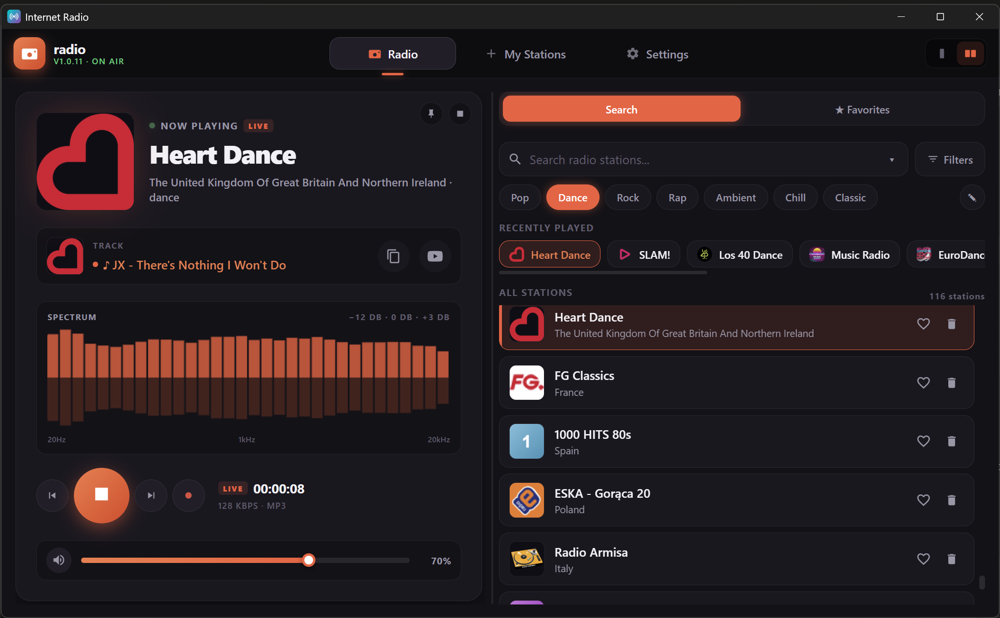
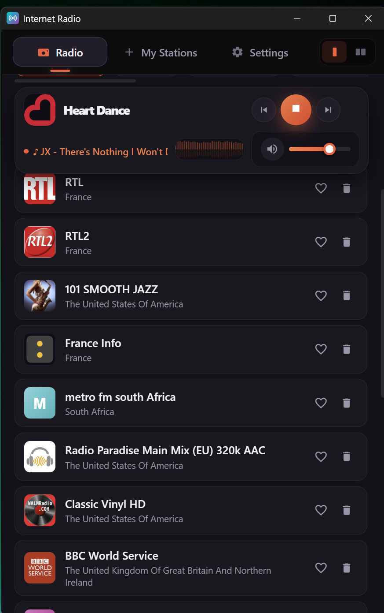
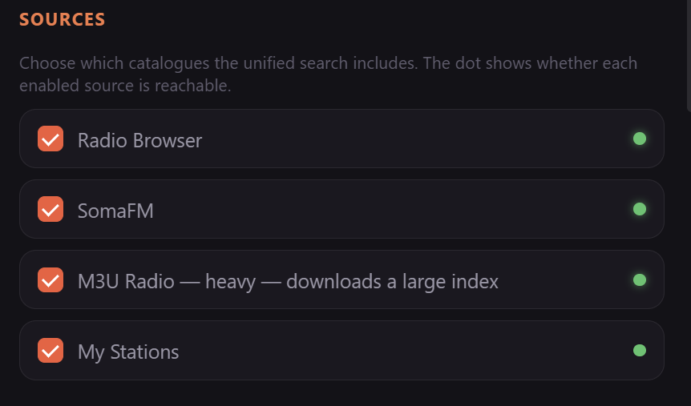
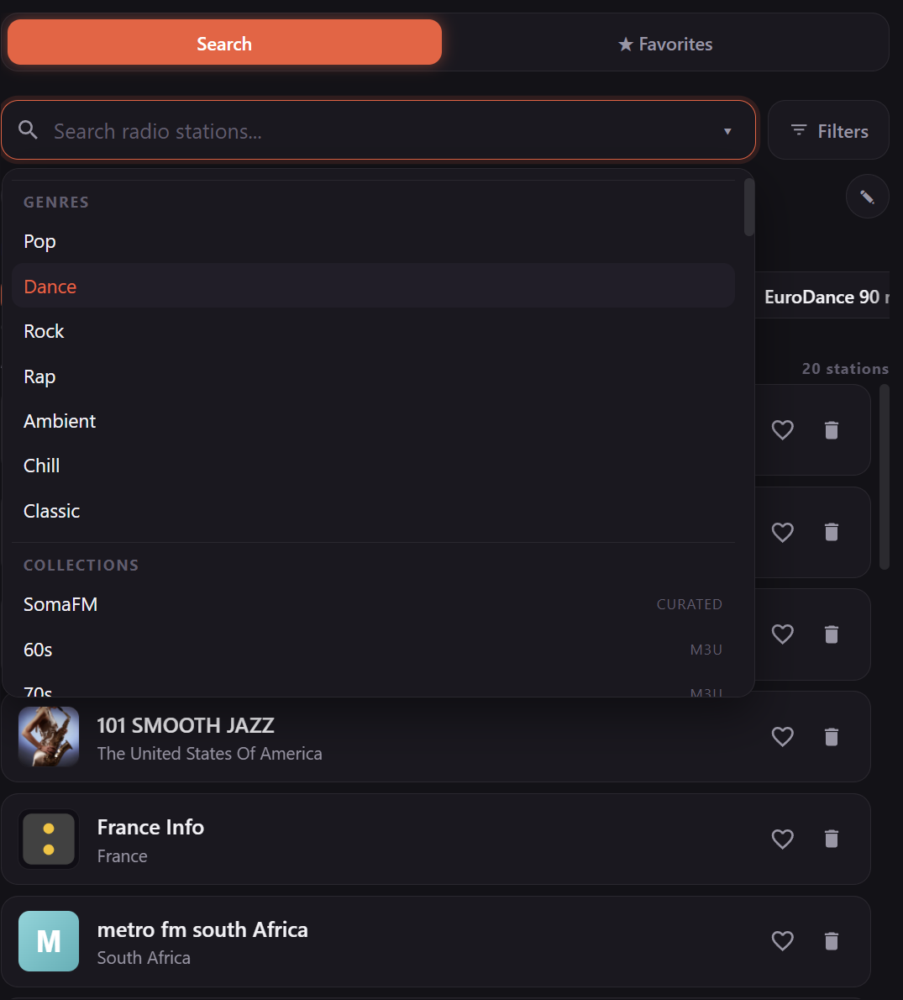

# Internet Radio

A desktop internet‑radio player built with **Tauri 2** (Rust backend) and a
dependency‑free **vanilla‑JS** frontend. Search tens of thousands of stations,
record streams, see live track titles, and tune the sound with a built‑in
equalizer — in a dark “studio” interface.

## Screenshots

| Wide view | Narrow view |
|-----------|-------------|
|  |  |

| Sources (Settings) | Search |
|--------------------|--------|
|  |  |

## Features

### Stations & search
- **Unified search** across all enabled sources at once — Radio Browser,
  SomaFM, M3U Radio, and your own custom stations — with de‑duplicated results.
- **Source management** in Settings: enable/disable each source with a live
  connectivity indicator (M3U Radio is off by default — it downloads a
  catalogue index on first use).
- **Combined search dropdown**: live suggestions, your genre presets, and
  curated collections (SomaFM channels, M3U genres).
- **Filters**: country, tag/genre, minimum bitrate, codec, language, sort order.
- **Editable genre presets** — add, remove and drag‑reorder chips, or add the
  current query straight from the search box with “+”.

### Library
- **Favorites** with drag‑to‑reorder, **blacklist**, **recently played**, and a
  **track history** of heard songs (each with a “find on YouTube” action).
- **Custom stations** — add / edit / delete / preview, plus import & export
  (JSON, M3U / M3U8, PLS, OPML).

### Playback
- HLS support, smooth fade in/out, volume and mute (the level is remembered
  between sessions).
- **Automatic reconnect** with exponential backoff. A station that was already
  playing gets a long retry budget, so a passing network glitch does not end an
  unattended session; one that never started is given up on quickly.
- **Live track titles** (ICY metadata) parsed through a built‑in local
  CORS proxy, so streams that browsers normally block just work. Stations whose
  `StreamTitle` carries a block of `key="value"` attributes (as iHeartRadio
  encoders send — either `title="…",artist="…",url="…"` or
  `Artist - text="…" song_spot="…" …`) are reduced to a plain `Artist - Title`,
  which also keeps the per‑track recording filenames readable.
- **Stream recording** — one continuous file, or split into one file per track.
- **10‑band equalizer** with presets and optional volume normalization.
- **Audio spectrum visualizer** (multiple styles, colour and sensitivity).
- **OS media‑session** integration (media keys / lock‑screen controls) and
  optional song‑change notifications.
- **Sleep timer** and a **wake‑to‑radio alarm**.

### Interface
- Three layouts via the header switch (top‑right):
  - **Narrow** — single column. Scrolling collapses the player into a sticky
    compact bar (logo + name + transport, track + mini‑spectrum + volume);
    click it to jump back to the top.
  - **Wide** — two columns with a **draggable divider** to resize the player.
  - **Compact widget** — a small always‑on‑top mini player.
- The chosen layout, player width, presets and source choices are all persisted.
- **Desktop auto‑updater** (checks and installs new releases from About).

### Keyboard & accessibility

- `Space` — play / stop. Ignored while typing in a field, and while a control
  that already answers to `Space` has focus, so tabbing to a button and pressing
  `Space` activates only that button.
- The header tabs follow the ARIA tabs pattern: `←` / `→` (and `Home` / `End`)
  move between Radio, My Stations and Settings.
- Station rows are reachable with `Tab`, activated with `Enter` / `Space`, and
  `↑` / `↓` moves between rows in the same list.
- The Edit-station dialog takes focus when it opens, keeps `Tab` inside itself,
  closes on `Escape`, and hands focus back to the control that opened it. While
  it is open the rest of the app is `inert`.
- Every control has a visible keyboard focus ring (`:focus-visible`, so a mouse
  click leaves no ring) and an accessible name; toggles expose their state via
  `aria-pressed` / `aria-selected` / `aria-expanded`, and toasts are announced
  through a polite live region.

## Data & sources

- [Radio Browser API](https://api.radio-browser.info/) — free, open database of
  30,000+ stations (with automatic mirror failover).
- [SomaFM](https://somafm.com/) curated channels.
- [m3u‑radio‑music‑playlists](https://github.com/junguler/m3u-radio-music-playlists)
  genre playlists. The unified search indexes the repo's `---everything-full.m3u`
  aggregate specifically: its sibling "lite" and "repo" aggregates are bare URL
  lists (or run to tens of megabytes), and a playlist without `#EXTINF` lines
  leaves every station named after its own stream URL. The index is rejected and
  the previous one kept if the downloaded playlist turns out to be nameless.

Settings, favorites, custom stations and history are stored locally in
**SQLite** (with a `localStorage` fallback). Nothing is sent anywhere except the
stream and metadata requests above. The app works fully offline apart from those
requests — the UI font is bundled, not fetched from a CDN.

Regenerable bulk data (the SomaFM and M3U catalogue caches, the negative favicon
cache) lives in a separate `caches` table and is read on demand, so it never
slows down startup. Deleting those rows only costs a re-fetch.

## Tech stack

- **Tauri 2** + **Rust** backend. The Rust side is split into focused modules:
  `proxy` (local CORS audio proxy + redirect/playlist resolving + ICY stripping),
  `metadata` (ICY parsing), `recording`, and `updater`.
- **Vanilla JS** ES modules (no bundler), grouped under `src/js/`
  (`core/`, `services/`, `features/`, `ui/`) with CSS partials in `src/styles/`.
  `styles/a11y.css` is imported last on purpose: it restates the focus rules of
  the component partials in their `:focus-visible` form, so keyboard users get a
  ring without changing how the app looks under the mouse.

The local proxy validates TLS certificates first and only falls back to an
unverified handshake when a station's certificate is expired/mismatched (logged
on stderr, and surfaced in the UI as an "Unverified" badge). Each launch
generates a random access token from the OS CSPRNG that the frontend must
present on every `/stream` request, so the proxy cannot be used as an open relay
by other local processes. Every upstream read is bounded by a 15 s stall timeout,
so a server that goes silent without closing the socket ends the stream and
triggers a reconnect instead of hanging.

### Tests

```bash
npm test
```

Runs the frontend unit tests (playlist parsers, saved-order reordering, EQ
band/preset consistency, formatting helpers) with the built-in Node test runner —
no test framework needed. The Rust parsers have their own `cargo test` suite.
CI runs `cargo fmt`, `cargo clippy`, `cargo test`, ESLint and `npm test`.

## Known limitations

- The local audio proxy speaks HTTP/1.0 and reads the stream body verbatim, so
  it does not decode HTTP **chunked transfer-encoding**. Virtually all Shoutcast
  / Icecast radio servers send a continuous (unchunked) body, but the rare
  station served chunked may produce artifacts.
- **Stream recording** writes the raw stream bytes to disk. Per-track splitting
  works for self-framing codecs (MP3, AAC/ADTS); container formats that need a
  global header (e.g. Ogg) are not re-framed per segment.

## Requirements

- Node.js (v18+)
- Rust (via [rustup](https://rustup.rs/))
- Tauri prerequisites: <https://tauri.app/start/prerequisites/>

## Getting started

Install dependencies:

```bash
npm install
```

Run in development:

```bash
npm run dev
```

Build a release bundle (installers under `src-tauri/target/release/bundle/`):

```bash
npm run build
```

## Releasing

Releases are built by GitHub Actions. Bump the version in `package.json`,
`package-lock.json` and `src-tauri/Cargo.toml` (`Cargo.lock` follows on the next
build). `tauri.conf.json` carries no version — Tauri reads it from `Cargo.toml`,
and the frontend reads it from the Tauri runtime, so there is nothing to change
in `src/js/`. Then push a `vX.Y.Z` tag:

```bash
git tag v1.2.3
git push origin v1.2.3
```

The tag triggers `.github/workflows/release.yml`, which builds and signs Windows
and macOS bundles in parallel (~10–15 min) and uploads them together with the
`latest.json` the updater reads.

**The release is created as a draft, so the last step is manual:** open
*Releases* on GitHub, pick the new draft and press **Publish release**. Until
then `releases/latest/download/latest.json` still points at the previous
release, so the in-app updater (Settings → About → *Check for updates*) reports
no update — even though the build succeeded. A draft left unpublished is the
usual reason a shipped version never reaches users.
